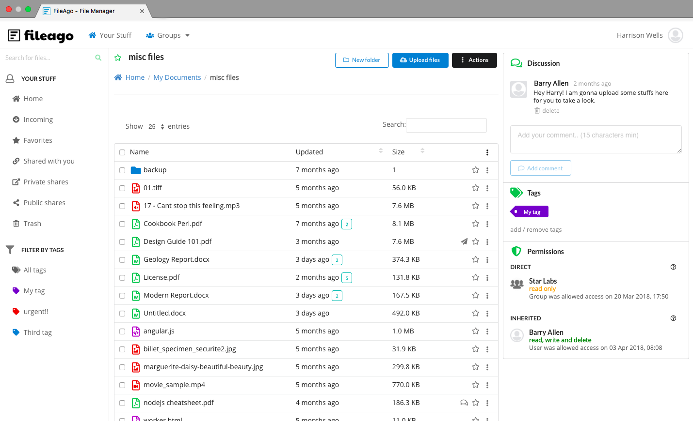
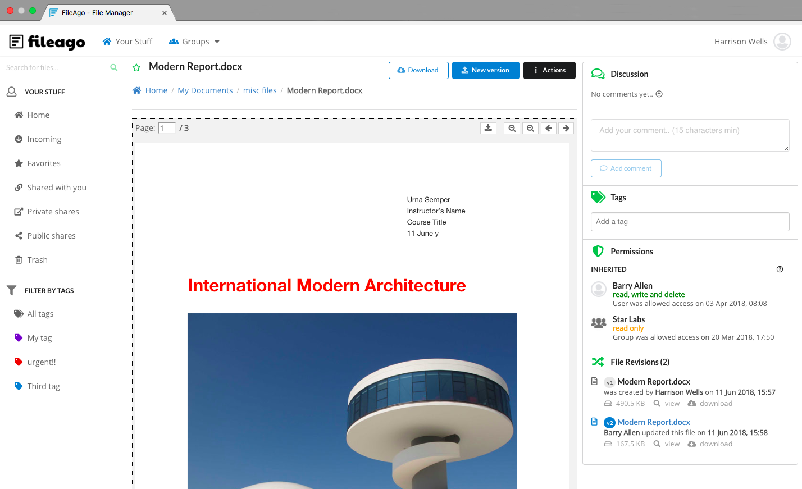
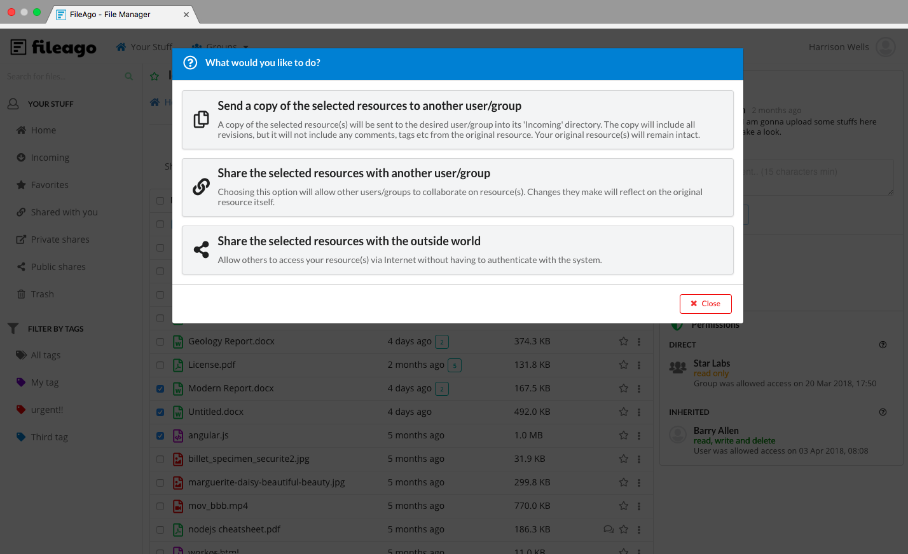
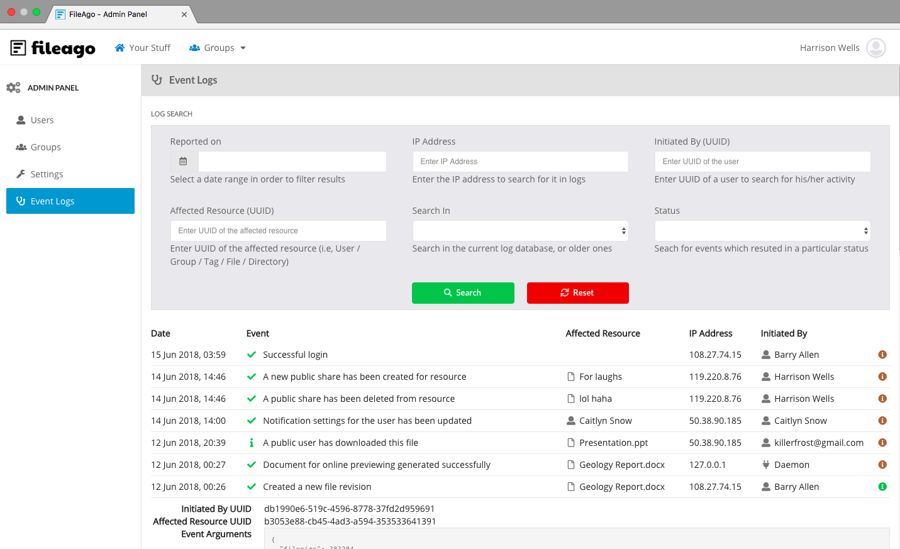

# FileAgo

**FileAgo** is a self-hosted secure file management, file sharing, file sync and collaboration software for teams and businesses.

Visit [fileago.com](https://www.fileago.com) for more details.

## Requirements

- Linux (preferably CentOS 7.x)
- Docker
- Git client, docker-compose
- 8 GB RAM
- 4 cores or more
- Atleast 500 GB of available disk space

## Screenshots

**Directory View**




**File View**




**File Sharing**




**Access Logs**




## Installation 

#### Prerequisites

1. Make sure that the hostname of the server resolves properly through DNS
2. Purchase a valid SSL certificate for the host, or create one using [Let's Encrypt](https://letsencrypt.org/)

Create a directory to store FileAgo data:

```shell
mkdir -p /opt/fileago/nginx
```

**NOTE:** `/opt/fileago` is also the base directory used by FileAgo (and is configured in `.env` file)

Copy the SSL key and certificate into the newly created directory. In case of Let's Encrypt, the commands will be like:

```shell
cp /etc/letsencrypt/live/<HOSTNAME>/fullchain.pem /opt/fileago/nginx/cert.crt
cp /etc/letsencrypt/live/<HOSTNAME>/privkey.pem /opt/fileago/nginx/cert.key
```

#### Installation

```shell
cd /etc
git clone https://github.com/fileago/fileago.git
cd fileago
```

Edit `settings.env`file and set value of `WEBHOSTNAME` to the server hostname. Start the install by executing:

```shell
docker-compose -f docker-compose.yml up -d
```

**NOTE:** If you wish to run `chat` or `cad` services, follow the instructions in `settings.env` file and start its corresponding docker-compose.`service`.yml files along with main docker-compose.yml. For example, in order to start chat, the command will be:

```shell
docker-compose -f docker-compose.yml -f docker-compose.chat.yml up -d
```

Visit https://HOSTNAME to begin the configuration process. Use the following information (exactly as it is given below) to fill in the form:

| Field          | Value        |
| -------------- | ------------ |
| Neo4j Host     | db           |
| Neo4j Port     | 7474         |
| Neo4j Username | neo4j        |
| Neo4j Password | mysecurepass |

Once the initial setup is over, login as `admin` and create users and groups. Logout from the `admin`account, and begin using FileAgo as one of the users you have created (use email address to login as normal users).

#### Cleanup

**CAUTION: only execute the below commands if you wish to remove FileAgo and all its data from your machine.**

```shell
cd /etc/fileago
docker-compose -f docker-compose.yml stop
docker-compose -f docker-compose.yml rm -f
rm -rf /opt/fileago
```

## Documentation

[Click here](https://www.fileago.com/docs/)

## Questions?

Contact [support@fileago.com](mailto:support@fileago.com) 


